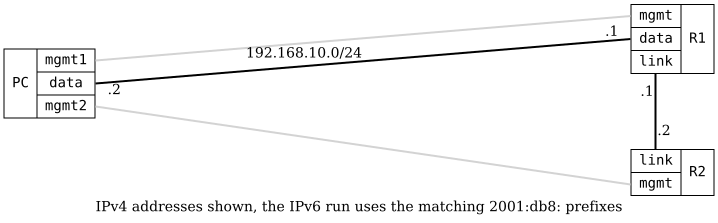

=== RIPng Passive Interface

ifdef::topdoc[:imagesdir: {topdoc}../../test/case/routing/rip_passive_interface]

==== Description

Verifies RIPng passive interface functionality.  A passive interface means
that RIP will include the interface's network in routing updates but will not
send or receive RIP updates on that interface.

R1 has two RIPng-enabled interfaces:
- data: Passive interface (network advertised but no updates sent/received)
- link: Active interface (RIP updates exchanged with R2)

R2 should learn about R1's data network from R1 via the link interface, even
though the data interface is passive.

==== Topology

==== Sequence

. Set up topology and attach to target DUTs
. Configure targets
. Wait for RIPng to exchange routes
. Verify connectivity to passive interface network

