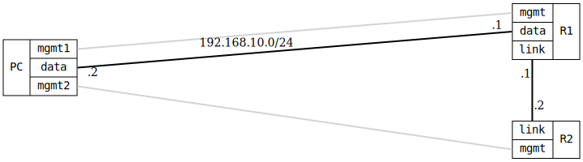

=== RIP Passive Interface

ifdef::topdoc[:imagesdir: {topdoc}../../test/case/routing/rip_passive_interface]

==== Description

Verifies RIP passive interface functionality.  A passive interface means that
RIP will include the interface's network in routing updates but will not send
or receive RIP updates on that interface.

R1 has two RIP-enabled interfaces:
- data: Passive interface (192.168.10.0/24 advertised but no updates sent/received)
- link: Active interface (RIP updates exchanged with R2)

R2 should learn about 192.168.10.0/24 from R1 via the link interface, even
though the data interface is passive.

==== Topology

==== Sequence

. Set up topology and attach to target DUTs
. Configure targets
. Wait for RIP to exchange routes
. Verify connectivity to passive interface network

