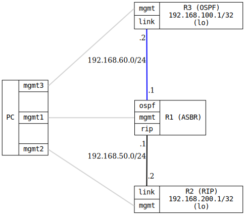

=== RIP Redistribution

ifdef::topdoc[:imagesdir: {topdoc}../../test/case/routing/rip_redistribute]

==== Description

Verifies that RIP can redistribute routes from other protocols.

Topology:
- R1: Gateway router running both RIP and OSPF
  - RIP interface to R2
  - OSPF interface to R3
  - Redistributes OSPF routes into RIP
  - Redistributes RIP routes into OSPF

- R2: RIP-only router with loopback 192.168.200.1/32

- R3: OSPF-only router with loopback 192.168.100.1/32

Expected behavior:
- R2 (RIP) should learn R3's OSPF loopback (192.168.100.1/32) via RIP redistribution
- R3 (OSPF) should learn R2's RIP loopback (192.168.200.1/32) via OSPF redistribution

==== Topology

==== Sequence

. Set up topology and attach to target DUTs
. Configure routers
. Wait for OSPF to converge on R1-R3 link
. Wait for RIP to converge on R1-R2 link
. Verify R2 (RIP) learns R3's OSPF routes via redistribution
. Verify R3 (OSPF) learns R2's RIP routes via redistribution

