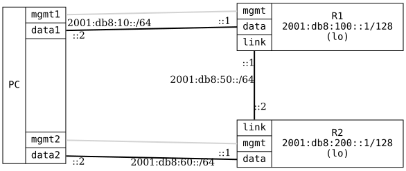

=== RIPng Basic

ifdef::topdoc[:imagesdir: {topdoc}../../test/case/routing/ripng_basic]

==== Description

Verifies basic RIPng (RIP for IPv6) functionality by configuring two routers
(R1 and R2) with RIPng on their interconnecting link.  The test ensures RIPng
routes are exchanged between the routers and end-to-end connectivity is
achieved over IPv6.

The test PC uses data1 interface to connect to R1's data port, and data2
interface to connect to R2's data port (which does not have RIPng enabled).
This verifies that RIPng status information remains accessible when a router
has non-RIPng interfaces.

==== Topology

==== Sequence

. Set up topology and attach to target DUTs
. Configure targets
. Wait for RIPng routes to be exchanged
. Test connectivity from PC:data1 to R2 loopback via RIPng
. Test connectivity from PC:data2 to R1 loopback via RIPng

