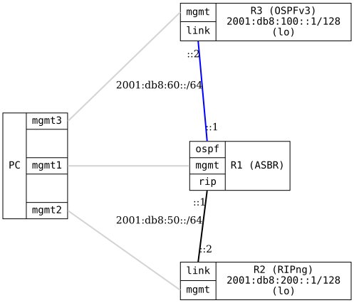

=== RIPng Redistribution

ifdef::topdoc[:imagesdir: {topdoc}../../test/case/routing/ripng_redistribute]

==== Description

Verifies that RIPng and OSPFv3 can redistribute routes between each other over
IPv6, mirroring the RIPv2/OSPFv2 redistribution test (this variant requires
OSPFv3 support).

Topology:
- R1: Gateway (ASBR) running both RIPng and OSPFv3
  - RIPng interface to R2
  - OSPFv3 interface to R3
  - Redistributes OSPFv3 routes into RIPng (redistribute ospf -> ospf6)
  - Redistributes RIPng routes into OSPFv3 (redistribute rip -> ripng)

- R2: RIPng-only router with loopback 2001:db8:200::1/128

- R3: OSPFv3-only router with loopback 2001:db8:100::1/128

Expected behavior:
- R2 (RIPng) learns R3's OSPFv3 loopback (2001:db8:100::1/128) via redistribution.
- R3 (OSPFv3) learns R2's RIPng loopback (2001:db8:200::1/128) via redistribution.

Note: OSPFv3 has no IPv4 address to derive a router-id from, so an
explicit-router-id is configured on the OSPFv3 routers.

==== Topology

==== Sequence

. Set up topology and attach to target DUTs
. Configure routers
. Wait for OSPFv3 to converge on R1-R3 link
. Wait for RIPng to converge on R1-R2 link
. Verify R2 (RIPng) learns R3's OSPFv3 routes via redistribution
. Verify R3 (OSPFv3) learns R2's RIPng routes via redistribution

