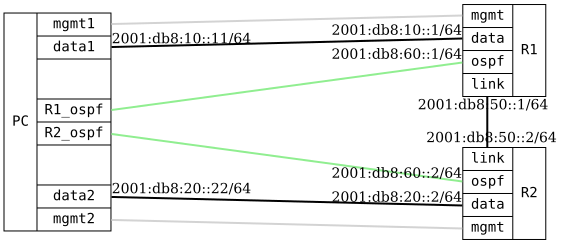

=== Route preference: OSPFv3 vs Static

ifdef::topdoc[:imagesdir: {topdoc}../../test/case/routing/route_pref_ospfv3]

==== Description

This test configures a device with both an OSPFv3-acquired route on a
dedicated interface and a static route to the same IPv6 destination on
another interface. The static route has a higher preference value than
OSPFv3.

Initially, the device should prefer the OSPFv3 route; if the OSPFv3 route
becomes unavailable, the static route should take over.

Note: OSPFv3 has no IPv4 address to derive a router-id from, so an
explicit-router-id is configured on every router.

==== Topology

==== Sequence

. Set up topology and attach to target DUTs
. Set up TPMR between R1ospf and R2ospf
. Configure targets
. Set up persistent MacVlan namespaces
. Wait for OSPFv3 and static routes
. Verify connectivity from PC:data1 to PC:data2 via OSPFv3
. Simulate OSPFv3 route loss by blocking OSPFv3 interface
. Verify connectivity via static route after OSPFv3 failover

