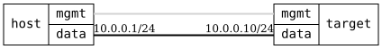

=== Basic

ifdef::topdoc[:imagesdir: {topdoc}../../test/case/snmp/basic]

==== Description

Enable the SNMP agent with a read-only community and query it over
SNMPv2c from the host.  Verify sysObjectID, that IF-MIB ifName at a given index
matches the interface of that if-index in the operational datastore,
that ifHCInOctets is consistent with the interface statistics, that an
unknown community is refused, and that disabling the agent stops it
answering.

Queries use numeric OIDs, so the test does not depend on MIB text files
being installed in the container.

==== Topology

==== Sequence

. Set up topology and attach to target DUT
. Set IPv4 address 10.0.0.10/24 on target:data
. Enable SNMP agent with a read-only community
. Read if-index and in-octets for target:data from operational
. Verify the host has the net-snmp client tools
. Verify agent reports the Infix sysObjectID
. Verify IF-MIB ifName at if-index matches the interface name
. Verify IF-MIB ifHCInOctets is consistent with operational data
. Verify an unknown community is refused
. Disable SNMP agent
. Verify agent no longer responds

