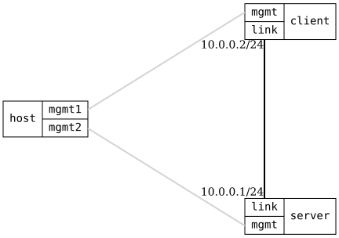

=== Remote Syslog

ifdef::topdoc[:imagesdir: {topdoc}../../test/case/syslog/remote]

==== Description

Verify logging to remote, acting as a remote, RFC5424 log format, TCP
transport (RFC 6587), and TCP message queueing: messages sent while the
link is down are delivered after link recovery within two retry timeouts.

==== Topology

==== Sequence

. Set up topology and attach to client and server DUTs
. Configure client as syslog forwarder and server as syslog sink
. Send security:notice log message from client and verify reception on server via UDP
. Reconfigure client to forward via TCP and server to accept TCP connections
. Verify server is listening on TCP port 514
. Send security:notice log message from client and verify reception on server via TCP
. Verify TCP message queueing: messages sent while link is down are delivered after recovery

