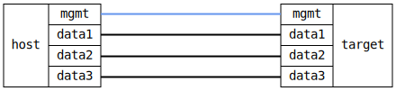

=== Basic NTP client test

ifdef::topdoc[:imagesdir: {topdoc}../../test/case/system/ntp_client]

==== Description

Verify NTP client with multiple servers, ensure one get selected.

==== Topology

==== Sequence

. Set up topology and attach to target DUT
. Configure NTP client on 'target'
. Verify one source is in 'selected' state on 'target'
. Verify three sources exist in NTP client on 'target'

