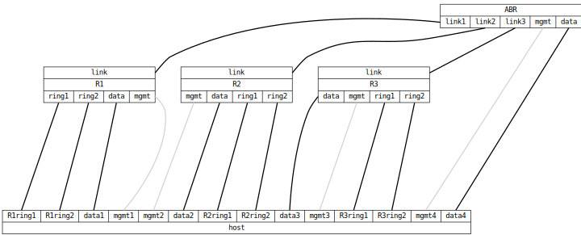

=== OSPF Container
==== Description
This use-case test verifies connectivity in an OSPF network to services
running as hosted containers inside each router.

NOTE: The _Controller_, _ABR_, and `data` connections are simulated by
the test PC. The `ringN` ports are connected to other DUTs via the test
PC, which can act as a link breaker.

.Use-case overview.
[#img-overview]
ifdef::topdoc[]
image::{topdoc}../../test/case/use_case/ospf_container/overview.svg[]
endif::topdoc[]
ifndef::topdoc[]
ifdef::testgroup[]
image::ospf_container/overview.svg[]
endif::testgroup[]
ifndef::testgroup[]
image::overview.svg[]
endif::testgroup[]
endif::topdoc[]

The DUTs are connected in a routed topology inside their own OSPF area.
A single area border router (ABR) is used to access the controller
network in OSPF area 0.  Each router also has "test point" connections
where the controller can attach other than its connection in area 0.

 - The ringN ports are intended to be connected to neighboring DUTs, but
   may at each end of the bus be used as test points
 - The data ports are intended to be test points for verifying
   connectivity with container B via br1
 - The uplink ports are for connecting to the ABR, at least one of the
   DUTs should not have a connection to the ABR, this to verify routing
   via another DUT
 - Area 1 is 10.1.Rn.0/16, and each router is assigned a /24

Each DUT hosts one application container and one system container, all
have the same setup, with only different subnets assigned.  A third
container is used to manipulate the firewall of each DUT, providing port
forwarding and masquerading.

Devices attached to the first bridge, `br0`, are supposed to be easily
accesible using IPv4, so internally they use IPv4 too, and to avoid any
risk of clashing with external IP subnets, IPv4 link-local addresses are
employed: `br0` request 169.254.1.1, so the second container (B) always
can reach it, the first container (A) reqquest 169.254.1.2 and the
second (B) request 169.254.1.3.  The network for devices attached to the
second bridge, `br1`, only use IPv6 link-local addresses.

.Internal network setup, here router R1 on subnet 10.1.1.1/24.
[#img-setup]
ifdef::topdoc[]
image::{topdoc}../../test/case/use_case/ospf_container/internal-network.svg[Internal networks]
endif::topdoc[]
ifndef::topdoc[]
ifdef::testgroup[]
image::ospf_container/internal-network.svg[Internal networks]
endif::testgroup[]
ifndef::testgroup[]
image::internal-network.svg[Internal networks]
endif::testgroup[]
endif::topdoc[]

 - *Container A* runs a very basic web server, it runs on port 80 inside
   the container, and `br0`, but is accessible outside on port 8080.
   The controller connects to each of these servers from OSPF area 0.
   For the controller to be able to distinguish between the servers,
   they all serve slightly different content
 - *Container B* runs a complete system with an SSH server.  During the
   test, the controller connects to this container using the `data` port
   to ensure the container can access all other parts of the network.
   To distinguish between the different container B's, each container
   will have a unique hostname derived from the chassis MAC address

==== Topology
ifdef::topdoc[]
image::{topdoc}../../test/case/use_case/ospf_container/topology.svg[OSPF Container topology]
endif::topdoc[]
ifndef::topdoc[]
ifdef::testgroup[]
image::ospf_container/topology.svg[OSPF Container topology]
endif::testgroup[]
ifndef::testgroup[]

endif::testgroup[]
endif::topdoc[]
==== Test sequence
. Set up topology and attach to target DUTs
. Configure DUTs
. Wait for all routers to peer
. Verify ABR:data can access container A on R1 (10.1.1.101)
. Verify ABR:data can access container A on R2 (10.1.2.101)
. Verify ABR:data can access container A on R3 (10.1.3.101)

<<<

